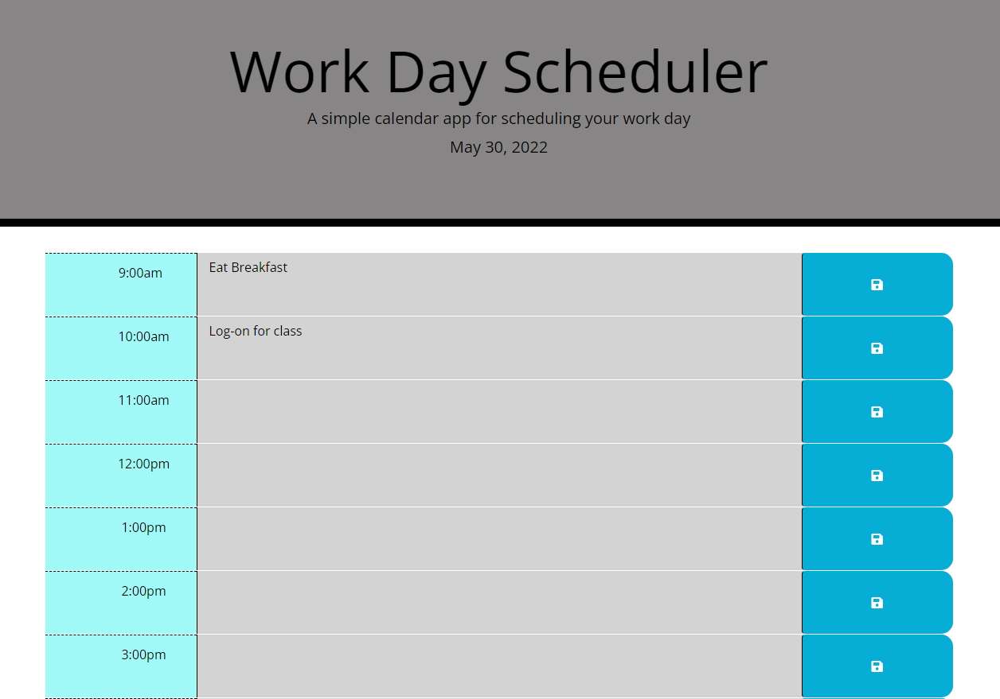

# 05 Third-Party APIs: Work Day Scheduler
## Module 5 Challenge

## Description
The goal of this challenge was to create a daily planner for an employee so that they can better manage their time. Most importantly the employee wanted the planner to satisfy a certain list of criteria items which include:
* When the planner is opened, please display the current day at the top
* Provide timeblocks for standard business hours
* Color code each timeblock to show whether the time is past, present, or future
* When you save an event for that timeblock, the event is stored locally and will reappear upon refresh of the page

## Screenshot

## Website
This [link](https://tyomoto.github.io/upgraded-winner/) will take you to deployed application on github pages.
